# My Poke Teams

"My Poke Teams" is a 2-page React web application where users can search for Pokemon (data retrieved from PokeAPI) and build the teams they want.

## Description

In the first instance, the user interacts with the home page where they can use a simple form to type in a Pokemon's name and an initial fun card to invite the users to search for a Pokemon. If the user types something wrong e.g. a wrong name a message and an image appear to inform the user about that. If the user successfully searches for a Pokemon, they can then see a card with the Pokemon's image, name, and a types, abilities and stats button. The user can interact with each button and see the relevant information about the Pokemon.

Furthermore, the card contains another button that the user can choose to click and initially create a team and also add this Pokemon to the team they just created. After a team is created the user will then have the option to add the Pokemon they want to either a new team or an existing team.

The teams will appear on the "MyPokeTeams" page, but when the user first uses the website, they won't have any teams, so a message with images will be presented to them and urge them to go to the home page and start creating their teams.

All pages share a navigation bar with buttons to choose the page they want to navigate to, a banner which contains a title that changes depending on the page and a footer where the user can click a link and see my React Portfolio website.

Lastly, the app has a third page, which contains a brief bio about me and links to my GitHub and LinkedIn profiles as well as my React Portfolio website.

## Link to My Poke Teams

See the demo [here](https://poke-teams-react-panosdeppy.vercel.app/)

## Screenshots

- For Desktop:

  
  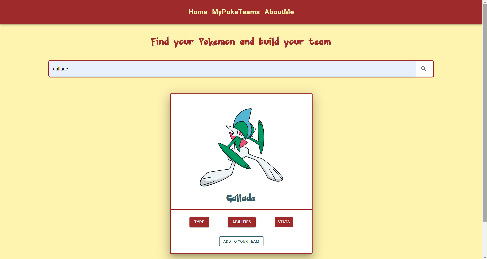
  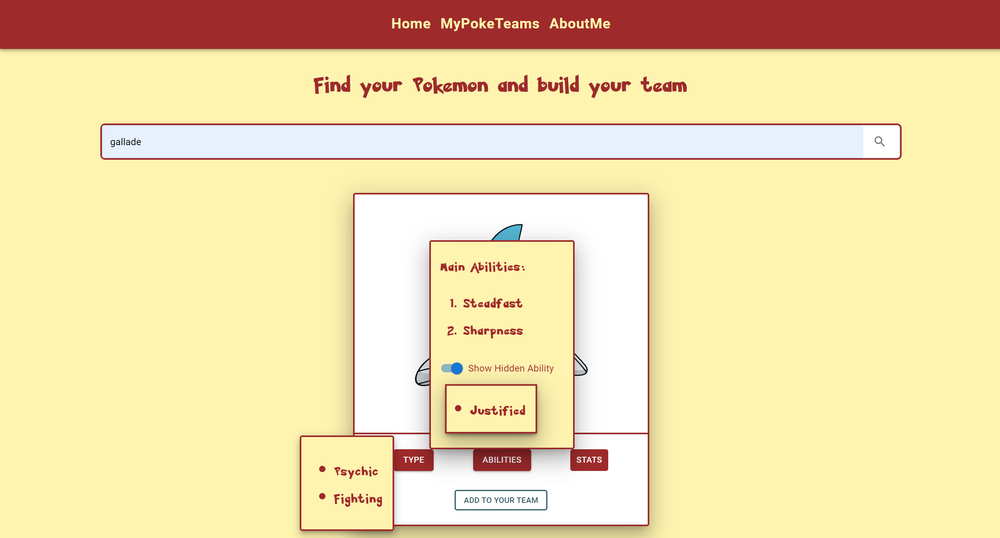
  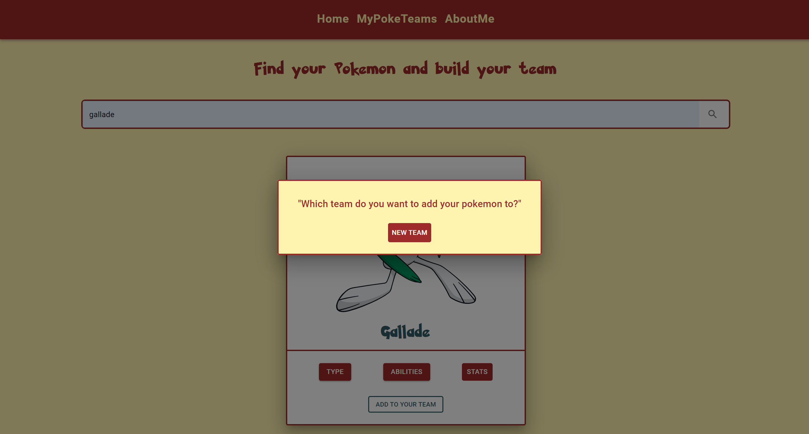
  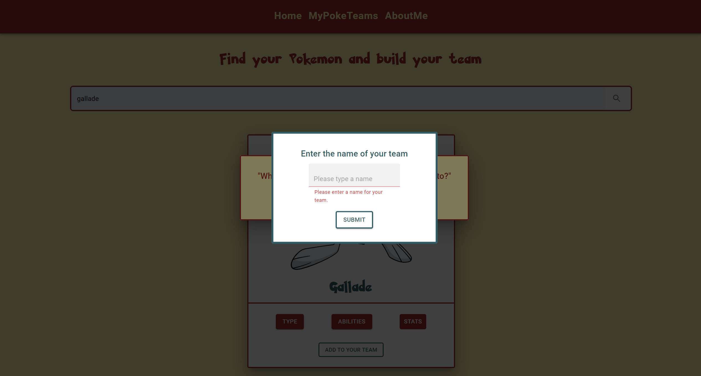
  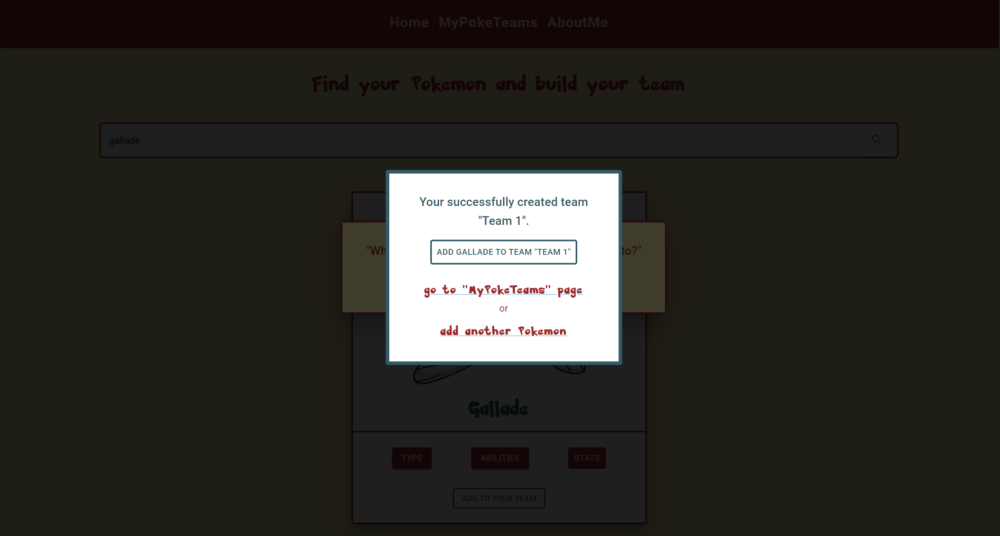
  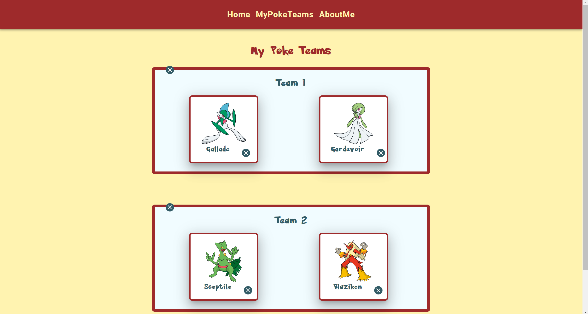

- For Mobile:

  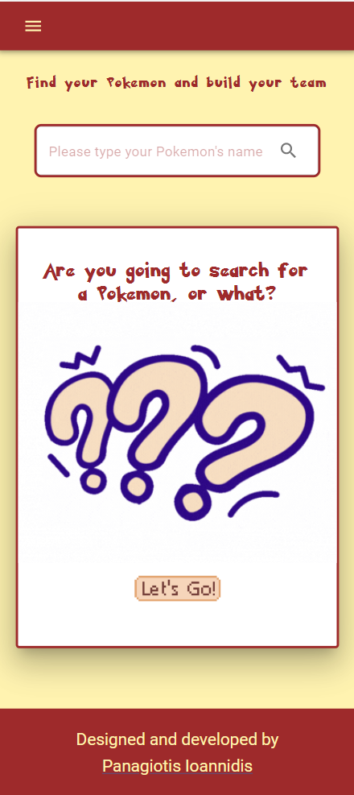
  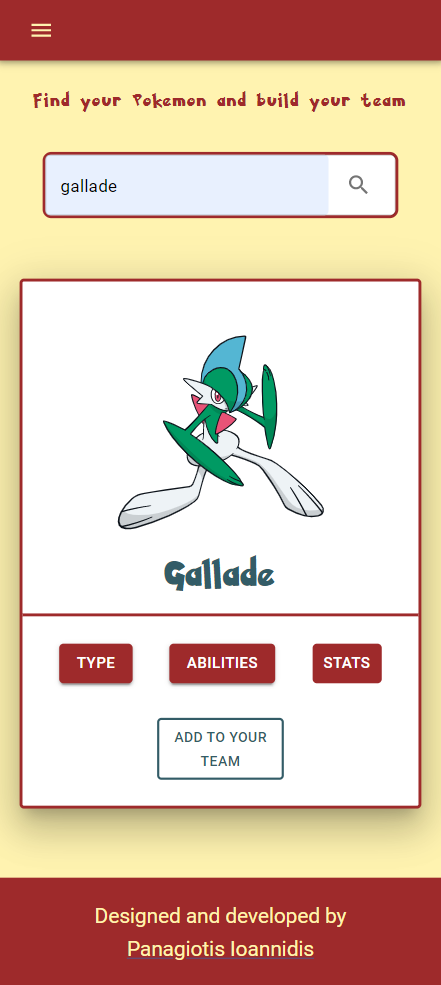
  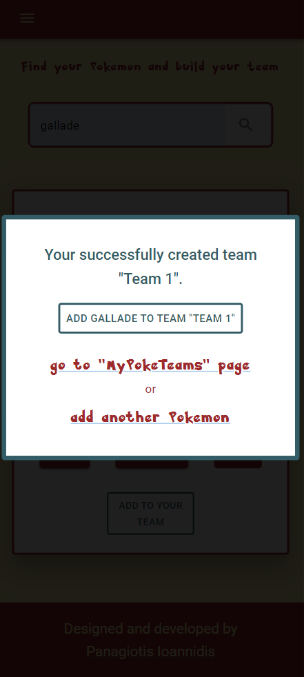
  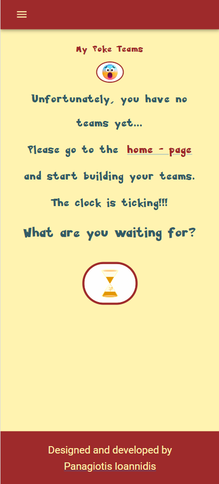
  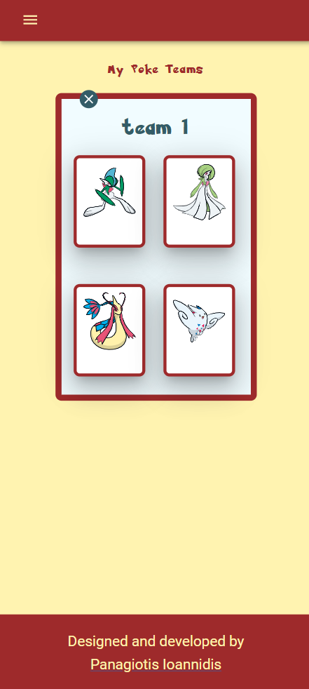
